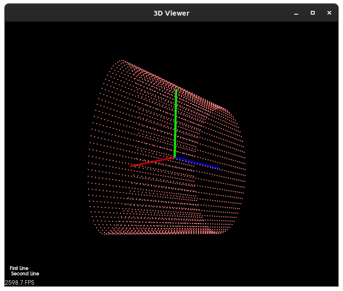
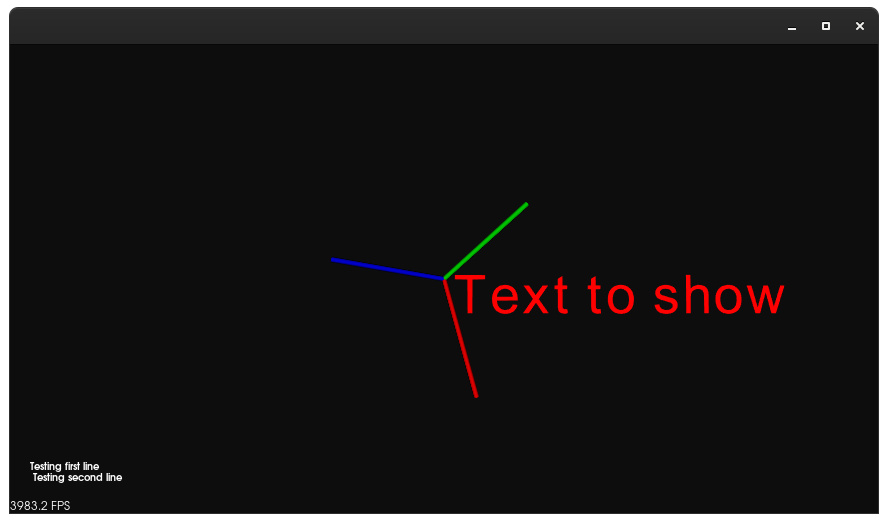

=== Text

Note: 
For all of the PCL code below the examples are all coded within a visualizer format (displayed below for reference)

[,cpp]
----
#include <pcl/visualization/pcl_visualizer.h>

pcl::visualization::PCLVisualizer::Ptr simpleVis (pcl::PointCloud<pcl::PointXYZ>::ConstPtr cloud){
	pcl::visualization::PCLVisualizer::Ptr viewer (new pcl::PCLVisualizer ("3D viewer"));
	viewer->addPointCloud<pcl::PointXYZ> (cloud, "sample data");
	// Viewer extras (i.e. point size, colour of background and data, text)
}
----	

==== Adding 2D Text

HALCON:

[,hdevelop]
----
disp_text( : : WindowHandle, String, CoordSystem, Row, Column, Color, GenParamName, GenParamValue : )
----

PCL:

[,cpp]
----
viewer->addText ("String", X_position, Y_position, id, Viewport);
----

String is the text you would like to display. The X_position and Y_position are where you would like the text to be displayed, if X and Y = 10, the text will be shown in the bottom left corner. id is the text object, equal to the text parameter.
This text is locked onto the WINDOWs X and Y coordinates. It will not travel with the 3D point cloud data.

HALCON: 

[,hdevelop]
----
new_line( : : WindowHandle : )
----

PCL:

[,cpp]
----
viewer->addText ("First line \n Second line", X_position, Y_position, id, Viewport);
----

We can use the addText function as before but simply adding a newline marker creates a secondary line in the window. Dont forgt to change your X and Y positions for the text appropriately.

HALCON: 

[,hdevelop]
----
qery_font( : : WindowHandle : Font)
----

Queries the fonts available for the text output window. They can be set with the operator set_font

==== Example of Simple Adjustments

[,cpp]
----
pcl::visualization::PCLVisualizer::Ptr simpleVis (pcl::PointCloud<pcl::PointXYZ>::ConstPtr cloud)
{
  pcl::visualization::PCLVisualizer::Ptr viewer (new pcl::visualization::PCLVisualizer ("3D Viewer"));

  viewer->setBackgroundColor (0, 0, 0);
  viewer->addPointCloud<pcl::PointXYZ> (cloud, "sample cloud");

  viewer->setPointCloudRenderingProperties (pcl::visualization::PCL_VISUALIZER_POINT_SIZE, 2, "sample cloud");
  viewer->setPointCloudRenderingProperties (pcl::visualization::PCL_VISUALIZER_COLOR, 1, 0.5, 0.5, "sample cloud");

  viewer->addCoordinateSystem (1.0);
  viewer->initCameraParameters ();

  viewer->addText ("First Line \n Second Line", 10, 20, "v1 text", 0);

  return (viewer);
}
----

==== Adding 3D Text (Point Specified/Locked)
Adding 3D text is best for addressing specific cloud arrays. This can be implemented with the below functions.
The 
PCL:
[,cpp]
----
#include <pcl/visualization/pcl_visualizer.h>

 pcl::visualization::PCLVisualizer::addText3D (
   const std::string &text, // This is the char[] string that will be displayed to the position specified 
   const PointT& position,  // This is the position pointer that can be set up in one of the following ways (below)
   double orientation[3],
   double textScale = 1.0,
   double r = 1.0,
   double g = 1.0,
   double b = 1.0,
   const std::string &id = 0,
   int viewport)
----

To set up a pointer for a set value at say the origin of your cloud point you can use this technique
[,cpp]
----
pcl::PointXYZ textPosition; // Creating a pointer for PCL
textPosition.x = 0;         // Sets the x to origin
textPosition.y = 0;         // Sets the y to origin
textPosition.z = 0;         // Sets the z to origin

viewer.addText3D<pcl::PointXYZ> ("Text to show", textPosition, 0.2, 1.0, 0.0, 0.0, "3DText", 0)
----
This 3D text addition will always face the viewer but will be dreagged around the visualisation with respect to the coordinate set.

This is strictly for operations using the vpcl::visualization::PCLVisualizer, pcl::PointXYZ version on point cloud library. To adjust to another point type you will need to change the typeface and name.
