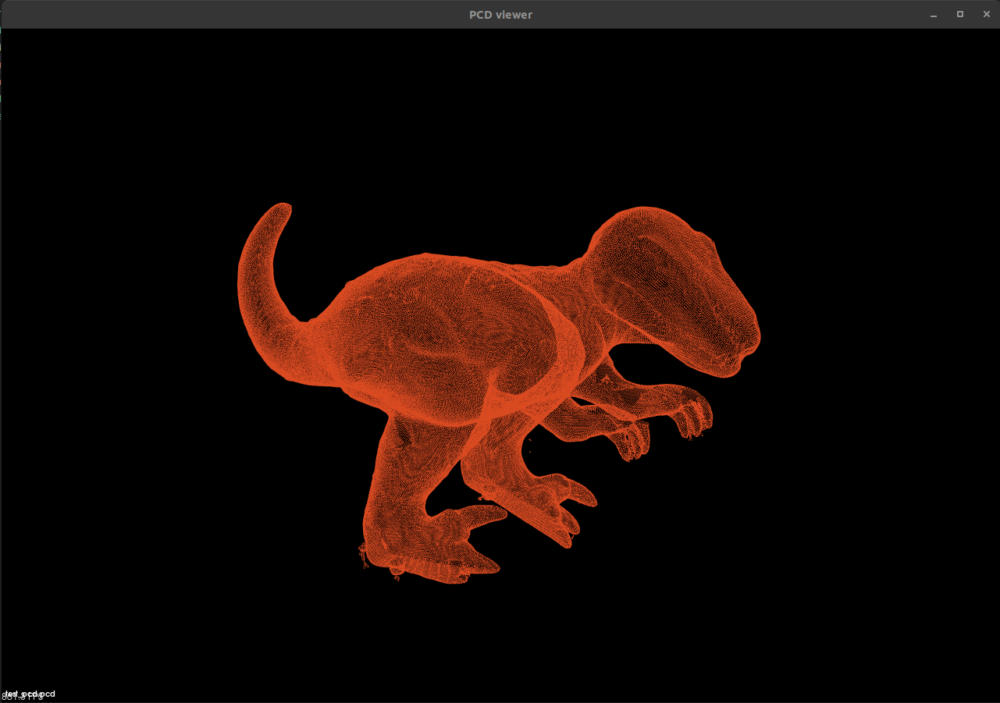

=== Creating Visualisations

==== Displaying the raw PCD file data
Using PCL-tools on ubuntu you are able to easily visualize any PCD file from the terminal using the below function.
This is a simple way to check PCD data files before you implement them into long visualization processes.

[,bash]
----
$ pcl_viewer PCD_file.pcd 
----

Installing PCL-tools is as simple as the following terminal command line in ubuntu.
[,bash]
----
$ sudo apt install pcl-tools 
----

==== Displaying Point Cloud Data From IDE
HALCON
[,hdevelop]
----
disp_object_model_3d( : : WindowHandle, ObjectModel3D, CamParam, Pose, GenParamName, GenParamValue :)
----

In PCL the visualisations are created mainly thorugh the format of a dedicated visualisation function. These visualisations can be manipulated and changed to suit the users needs. The visualisation function below creates a visualizer window called "New Cloud". Following this the cloud data, 'img', with a name for viewport identification, most examples use '0' for the veiwport number/identification.

PCL:
[,cpp]
----
#include <pcl/visualization/pcl_visualizer.h>
pcl::visualization::PCLVisualizer::Ptr viewer(new pcl::visualization::visualizer ("New Cloud"));
viewer->addPointCloud(new PointCloud(img)), 0);
----

The '0' in the above line states the viewport identification. Can be any int for the viewport.

==== Cloud Point Properties (Colour and Size)
For colour and size we can adjust these through the set viewer model similar to the addPointCloud model. However, these require some inputs. 
	- Size 	Can be a number an int from 1.0 and above, the larger the number the larger the point size.
	- r, g, b, are the colours Red, Green and Blue which can have a lightness or darkness level between 0.0 (dark) and 1.0 (light) inclusive.

PCL:
[,cpp]
----
viewer->setPointCloudRenderingProperties (pcl::visualization::PCL_VISUALIZER_POINT_SIZE, size, cloud_name)

viewer->setPointCloudRenderingProperties (pcl::visualization::PCL_VISUALIZER_COLOR, r, g, b, cloud_name)
----

There are also some basic colourmaps premade for use by PCL, these can be found at https://pointclouds.org/documentation/namespacepcl_1_1visualization.html#a283c01126d7d30bab271e86a4ea5c5ee[the link provided] under rendering properties.

==== Line Width 
Line Width uses the same paramater styles as the Point Size method above, integers from 1.0 and above. 
PCL:
[,cpp]
----
viewer->setPointCloudRenderingProperties (pcl::visualization::PCL_VISUALIZER_LINE_WIDTH, size, cloud_name)
----

==== Background Properties
PCL:
[,cpp]
----
viewer->setBackgroundColor(r, g, b, cloud_name)
----
